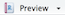
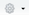

# Replicating simulations in JaamSim 

* In the same folder as this file, `05.cfg` contains a JaamSim model of the original Nimitz Coffee Bar setup

* It is configured to run once, with 1 barista 

* Let's emulate the experiment and analysis in the original Nimitz Coffee Bar report: 

    - For 1, 2, 3, and 4 baristas in the shop, run the simulation 100 times
    
    - Collect average delay experienced at BaristaQ for each of these $400 = 4 \times 100$ runs

* How can we configure JaamSim to do this? 

* First, let's configure JaamSim to run 4 sets of 100 runs -- under __Simulation > Multiple Runs__, input the following:

    | Keyword                | Value   |
    | ---------------------- | ------- |
    | RunIndexDefinitionList | `4 100` |
    | StartingRunNumber      | `1-1`   |
    | EndingRunNumber        | `4-100` |
    
    - __RunIndexDefinitionList__ defines 2 run indices: 
    
        - `RunIndex(1)` ranges from 1 to 4
        
        - `RunIndex(2)` ranges from 1 to 100
    
    - A total of 400 runs will be performed, with the run indices changing in the following sequence:
    
        `1-1, 1-2, ..., 1-100, 2-1, 2-2, ..., 2-100, 3-1, 3-2, ..., 3-100, 4-1, 4-2, ..., 4-100`
        
    - We don't need to perform all of these runs -- we can specify where in this sequence to start and end using __StartingRunNumber__ and __EndingRunNumber__

* Next, let's configure JaamSim to output the average delay at BaristaQ from each run -- under __Simulation > Key Inputs__, input the following:

    | Keyword             | Value                                           |
    | ------------------- | ----------------------------------------------- |
    | GlobalSubstreamSeed | `[Simulation].RunIndex(2)`                      |
    | UnitTypeList        | `DimensionlessUnit  DimensionlessUnit  TimeUnit`|
    | RunOutputList       | `{  [Simulation].RunIndex(1)  }  {  [Simulation].RunIndex(2)  }  {  [BaristaQ].AverageQueueTime  }` |

    - __GlobalSubstreamSeed__ sets the seed of each run -- we'll discuss this more later in the semester

    - __RunOutputList__ defines the output values we want to write to a file for each run 
    
    - __UnitTypeList__ defines the unit types for the quantities in RunOutputList
  
* Finally, let's configure JaamSim to run the simulation with the appropriate number of baristas -- for the __Baristas__ object, input the following:
  
    | Keyword  | Value                      |
    | -------- | -------------------------- | 
    | Capacity | `[Simulation].RunIndex(1)` |

    - This sets the number of baristas to `RunIndex(1)`. Why does this make sense?
    
* Now we're ready to run our experiment -- press the Run button and let JaamSim go!

* When JaamSim is done, you should see a file named `05.dat`

* Let's see what it looks like - open it in a text editor (RStudio works fine)

    - The file has 3 columns of data, each corresponding to one of the items in RunOutputList
    
    - The first row contains the column headers
    
    - The second row contains the units of each column -- this is a bit hard to see, since 2 of the columns are dimensionless, and therefore have "blank" units

* Our next step is to analyze this data. But first...

# A brief introduction to R Markdown

* __R Markdown__ is a way of writing documents that include R code and the code's automatically generated output

* For example, this document is written in R Markdown

* An R Markdown document contains 3 types of content:
  
    - A __header__ surrounded by `---`s (see the top of this document)
    
    - __R code chunks__ surrounded by <code>```</code>s 
    
    - __Text__ written using Markdown formatting annotations
    
* To run a code chunk, click the  icon

* RStudio will execute the code and display the results inline with your file

* Try it with the chunk below:

```{r}
# Load necessary R packages
library(dplyr)

# Print cheesy message
print("Hello world!")
```

* To view this document formatted nicely, click the  icon above

    - A nicely formatted rendering of this document should appear either in a new window or to the side in the __Viewer__ tab
    
    - This is configurable in __Output Options__ under the  icon above

* Take a look at this `.Rmd` file for examples on how to make your text __bold__ or _italic_, or in bulleted lists, or even in tables

* Take a look [here](http://rmarkdown.rstudio.com/articles.html) for an assortment of articles on R Markdown, including basics on Markdown

# Reading JaamSim output data into R

* Back to our simulation experiment...

* Let's read the data that JaamSim generated into R, and examine the first few rows:

```{r}
# Read output from simulation


# Examine the first few rows

```

* [Documentation for `read.table`](https://www.rdocumentation.org/packages/utils/versions/3.4.1/topics/read.table)

* `read.table` reads a text file in with tabular data, and outputs a data frame containing the data

    - `sep="\t"` tells `read.table` that values on each line of the file are separated by a tab character, which is what JaamSim happens to output
    
    - `skip=2` tells `read.table` to skip 2 lines before beginning to read data
    
    - `col.names=c("number.of.baristas", "run", "avg.delay")` gives `read.table` the names of the columns in the data frame it outputs
    
        - Remember that `c(item1, item2, item3, ...)` is a vector in R
        
# Computing observed sample means and confidence intervals

* Now that we have the JaamSim output data in R, we want to: 

    1. Split our dataset into 4 groups of 100 observations, with each group corresponding to a different number of baristas in the shop
    
    2. For each group, compute the observed sample mean of the average delay and the length of the corresponding confidence interval

* We will use __dplyr__ to manipulate and summarize the data

* [Homepage for dplyr, with links to tutorials and documentation](http://dplyr.tidyverse.org)

* dplyr has 5 key "verbs" that, when put together, will take care of most data manipulations:

    - `filter()`: pick observations by their values
    
    - `arrange()`: reorder the rows
    
    - `select()`: pick columns by their names
    
    - `mutate()`: create new columns with functions of existing columns
    
    - `summarise()`: collapse many values down to a single summary

* These "verbs" (functions) can be used with `group_by()` which changes the scope of each verb from operating on the entire data frame to operating it on group-by-group

* So, how can we combine these functions to get what we want?

```{r}
# Group JaamSim output data by number of baristas
# Get mean and CI length for each group

```

* `%>%` is the __pipe operator__, which can be used to chain several "verbs" (functions) together
